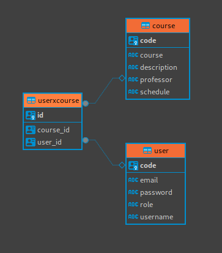

# Creando API Spring boot - first data base

Los primero pasos para crear una api, es tener definido una base de datos con sus entidades y conexiones asi se evitan errores, una vez creado nuestro diagrama procedemos a la creacion de nuestra api en Spring boot

Primero, al crear nuestro nuevo proyecto escogemos que su paqueteria sera `.war` , tambien que sus paquetes los descargue de `gladle` (NO de maven que es otro repositorio de librerias), seguidamente agregamos las siguiente dependencias para nuestro proyecto:

* Lombok
* Spring web
* Mustache
* JDBC API
* Spring data JPA
* Spring data JDBC
* PostgreSQL Driver
* Validation

Aceptamos e instalamos la dependencias para nuestro proyecto, en este caso intalamos un `ORM` para facilitarlos la comunicacion con nuestro servidor

> [!IMPORTANT]
> Tener un servicio activo, puede ser en un contenedor en docker o en la computadora local, en caso se en un contendor el comando es el siguiente

```terminal
sudo docker run --name postgresCapas2 -p 5050:5432 -e POSTGRES_PASSWORD=capasproyecto -d postgres 
```

Una vez creado nuestro proyecto procedemos a crear nuestra base de datos en `Postgres`, puede ser por linea de comando o graficamente:

```SQL
create database db_pre_parcial;
```
Una vez creada nuestra base de datos procedemos a modificar nuestro archivo `application.properties`, le pegamos el siguiente codigo:

```yml
spring:
    sql:
        init:
            data:
    application:
        name: preparcial
    mustache:
        suffix: .html
    datasource:
        url: jdbc:postgresql://localhost:5050/db_pre_parcial
        username: postgres
        password: capasproyecto
    jpa:
        hibernate:
            ddl-auto: update
        properties:
            hibernate:
                globally_quoted_identifiers: true
        show-sql: true
```
Una vez pegado nuestro codigo cambiamos la extencion del archivo a `.yml`, nuestro archivo ahora seria `application.yml`, una vez creada modificado podemos crear nuestas entidades

Antes de crear nuestras entidades creamos nuestar arquitectura de carpetas, que estara organizada de la siguiente manera:

```terminal
.
├── controllers
│   └── NombreController.java (ejemplo archivo controller)
├── models
│   ├── dtos
│   │   └── NombreDTO.java (ejemplo de archivo tipo DTO)
│   └── entities
│       └── Nombre.java (ejemplo de entities)
├── repository
│   └── NombreRepository.java (ejemplo repository, clase tipo interface)
├── services
│   ├── servicesImple
│   │   └── NombreServiceImple.java (un ejemplo de un servicio Implement)
│   └── NombreService.java (un ejemplo de un servicio tipo interface)

```
>Crearemos una tabla usuarios y una tabla cursos, es decir buscamos hacer una relacion N:N, aunque en el codigo sera la misma idea de 1:N (one to many), escrivimos el siguente codigo:




## Creando entidades (tablas)

Como podemos observar en la imagen anterior la relacion entre `user` y `userxcourse` es de 1:N, igualmente de `course` a `userxcouse`, es por eso que al programarlas se ara de la misma forde de 1 a N (one to many)

Comenzamos creando el archivo `user` en la ruta `models.entities`y digitando el siguiente codigo para crear nuestra entidad (tabla user) :

```java

package com.example.preparcial.models.entities;

import com.fasterxml.jackson.annotation.JsonIgnore;
import jakarta.persistence.*;
import lombok.AllArgsConstructor;
import lombok.Data;
import lombok.NoArgsConstructor;
import java.util.List;
import java.util.UUID;

@AllArgsConstructor
@NoArgsConstructor
@Data
@Entity
@Table(name = "user")
public class User {
    @Id
    @GeneratedValue(strategy = GenerationType.UUID)
    private UUID code; // nombre id

    private String username;
    private String password;
    private String email;
    private String role;

    //creando relacion de 1 a muchos, un usuario puede tener muchos cursos
    @OneToMany(mappedBy = "user", fetch = FetchType.LAZY)
    @JsonIgnore
    private List<InscriptionCourse> inscriptionXCourse;
    //el usuario tendra una lista de cursos pero se escrive ignore para que no se repita la lista

    public User(String username, String password, String role) {
        this.username = username;
        this.password = password;
        this.role = role;
    }
}

```

una vez creada nuestra tabla de `user` creamos otro archivo llamado `course`  para crear la tabla de `course`, escrivimos lo siguiete:

```java

package com.example.preparcial.models.entities;

import com.fasterxml.jackson.annotation.JsonIgnore;
import jakarta.persistence.*;
import lombok.AllArgsConstructor;
import lombok.Data;
import lombok.NoArgsConstructor;

import java.util.List;
import java.util.UUID;

@AllArgsConstructor
@NoArgsConstructor
@Data
@Entity
@Table(name = "course")
public class Course {
    @Id
    @GeneratedValue(strategy = GenerationType.UUID)
    private UUID code;
    private String course;
    private String description;
    private String professor;
    private String schedule;

    @OneToMany(mappedBy = "course", fetch = FetchType.LAZY)
    @JsonIgnore
    private List<InscriptionCourse> inscriptionXCourse;
}

```

Creamos nuestra tabla cruz, para que un usuario pueda escrivir sus cursos, creamos otro archivo llamado `InscriptionsCourse` y digitamos el siguiente codigo:

```java
package com.example.preparcial.models.entities;

import jakarta.persistence.*;
import lombok.AllArgsConstructor;
import lombok.Data;
import lombok.NoArgsConstructor;

import java.util.UUID;

@AllArgsConstructor
@NoArgsConstructor
@Data
@Entity
@Table(name = "UserXCourse")
public class InscriptionCourse {
    @Id
    @GeneratedValue(strategy = GenerationType.UUID)
    private UUID id;

    //Llave de usuario
    // nombre de la comlumna user_id queu se relacionara con code campo de la tabla user
    @ManyToOne(fetch = FetchType.EAGER)
    @JoinColumn(name = "user_id", referencedColumnName = "code")
    private User user; //tipo de dato a guardar

    @ManyToOne(fetch = FetchType.EAGER)
    @JoinColumn(name = "course_id", referencedColumnName = "code")
    private Course course;

}

```

Una vez creado y escrito el codigo en nuestros archivo procedemos a ejecutar nuestro programa, al correr nuestro programa podemos ver como se generaron nuestras tablas en la base de datos

## Creando querys

Antes de comenzar a crear nuestras Querys es importante saver el funcionamiento de cada uno de nuestros archivos, ya que tambien es posible hacer todo el codigo en un solo archivo pero es eso es una falta GRAVE a la seguridad de los datos, ya que si en caso se sufre un ataque los servicios estan aislados y los controladores tambien y asi sus demas componentes, igualmanete con una correcta arquitectura de servidores y la separacion de reponsavilidades en nuestro codigo todo puede ser MUCHO mas seguro.

>Tenemos que saver que la comunicacion de nuestros archivos es la siguiente
> [!IMPORTANT]
>*Controller* **-->** *Services* **-->** *Repository*

* *Controlers* controlar el flujo de nuestra aplicaciones, tambien hace las validaciones antes de pasar a nuestro archivo service

* *Services* nuestros archivos services encargados de ejecutar las querys, consultas que solicita nuestro controller, service ejecuta la query pasandosela al su Repository

* *Repository* Encargado de la COMUNICACION con el ORM que se comunica DIRECTAMENTE con la base de datos, en el cual cuenta con muchas consultas predefinidas y que podemos hacer sin necesidad de hacer una query en SQL y conectar y desconenctar la conxion a nuestra base de datos, asi como el CRUD


> [!CAUTION]
> Las Querys que se presentaran a continuacion *NO ESTAN VALIDADAS*, por lo tanto se tiene que hacer filtros, validaciones que se valla a pasar antes al servicio (las validaciones se hacen el el controlador)

Como primera query, aprenderemos a insertar (POST) en una tabla y consultar (GET), para eso creamos un archivo llamada `UserRepository.java` de tipo interface en el cual estara comunicado con el ORM y le diremos que es tipo User de nuestra entidad, escrivimos el siguiente codigo: 

```java

package com.example.preparcial.reposiries;

import com.example.preparcial.models.entities.User;
import org.springframework.data.jpa.repository.JpaRepository;

import java.util.UUID;

import org.springframework.data.jpa.repository.JpaRepository;
import java.util.UUID;

public interface UserRepository extends JpaRepository<User, UUID> {

}

```

Despues creamos un archivo en nuestra carpeta `.services` llamado `UserService` de tipo interface, escrivimos el siguiente codigo:

```java

package com.example.preparcial.services;

import com.example.preparcial.models.dtos.AddUserDTO;
import com.example.preparcial.models.entities.InscriptionCourse;
import com.example.preparcial.models.entities.User;

import java.util.List;

public interface UserService {
    List<User> FindAll();
    void AddUser(AddUserDTO user);
}

```
Ahora creamos otro archivo (clase) en nuestra carpeta `serviceImpl` llamado `UserServiceImpl`, escrivimos el siguiente codigo:

```java

package com.example.preparcial.services.ServicesImpl;

import com.example.preparcial.models.dtos.AddUserDTO;
import com.example.preparcial.models.entities.InscriptionCourse;
import com.example.preparcial.reposiries.UserRepository;
import com.example.preparcial.services.UserService;
import com.example.preparcial.models.entities.User;
import org.springframework.beans.factory.annotation.Autowired;
import org.springframework.stereotype.Service;

import java.util.List;

@Service
public class UserServiceImple implements UserService {

    @Autowired
    private UserRepository userRepository;
    @Override
    public List<User> FindAll() {
        return userRepository.findAll();
    }

    @Override
    public void AddUser(AddUserDTO user) {
        User newUser = new User();
        newUser.setUsername(user.getUsername());
        newUser.setPassword(user.getPassword());
        newUser.setEmail(user.getEmail());
        newUser.setRole(user.getRole());
        userRepository.save(newUser);
    }

}

```

